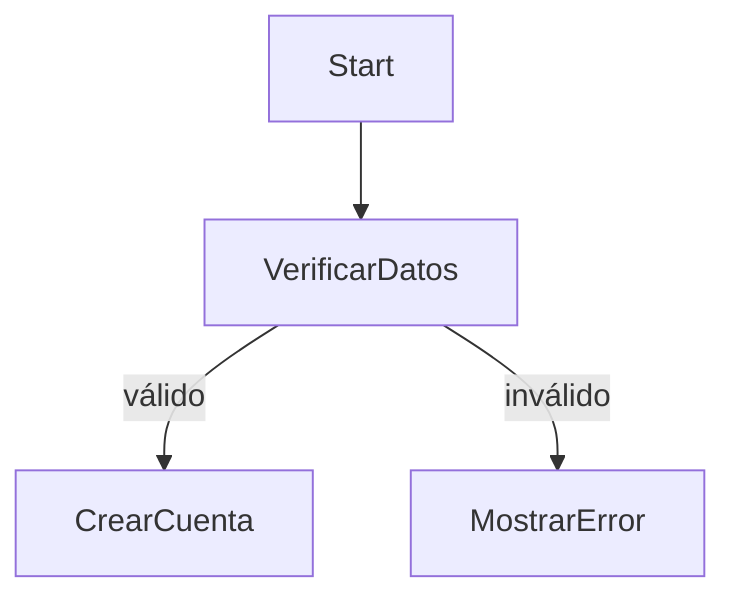

Excelente pregunta. Si ya estás o te estás formando como **senior developer, arquitecto o ingeniero de software**, entender **por qué y cómo se usa pseudocódigo hoy en día** (más allá de la teoría académica) es fundamental. Aunque no se ejecute, **el pseudocódigo sigue teniendo valor real y estratégico** en múltiples contextos del desarrollo profesional.

---

## ¿Qué es pseudocódigo, realmente?


> **Relacionado**: [[01-Ciberseguridad/Fundamentos/ELPSCRK/DICCIONARIOS|DICCIONARIOS]]. [[01-Ciberseguridad/Herramientas/Reconocimiento/ARIN|ARIN]]. [[03-Desarrollo-Software/Distribuido/Microservicios|Microservicios]]. [[02-Ciencias-Computacion/Algoritmos-EEDD/Algoritmos/recorridos|recorridos]]. [[02-Ciencias-Computacion/IA/Notas|Notas]].

El **pseudocódigo** es una **representación abstracta, informal y legible por humanos** de un algoritmo o proceso. No sigue una sintaxis estricta de ningún lenguaje, sino que **mezcla expresividad matemática, lógica y estructuras de control tipo programación** (if, while, for…).

---

##  ¿Por qué usar pseudocódigo en el mundo real?

###  1. **Diseño de algoritmos antes de codificar**

- Permite **prototipar la lógica** sin distraerse con detalles de sintaxis.
    
- Útil para **validar estructuras algorítmicas complejas** antes de pasar a implementación.
    
- Por ejemplo: planificación de **recorridos en árboles, flujos de datos, procesamientos en batch, parsers, etc.**
    

 _Ejemplo típico_: definir un algoritmo de scheduling para un microservicio de notificaciones masivas.

---

###  2. **Documentación técnica o diseño de bajo nivel**

- Se usa en **documentos funcionales/técnicos**, especialmente cuando hay muchos equipos o se delega la implementación.
    
- Permite que cualquier desarrollador, sea cual sea su stack, **entienda la lógica del sistema**.
    

 _Ejemplo real_: en un equipo DevOps y backend, documentar cómo funciona una estrategia de fallback para múltiples endpoints.

---

###  3. **Entrevistas técnicas**

- A nivel senior, se espera que puedas:
    
    - Resolver problemas algorítmicos en entrevistas técnicas.
        
    - **Comunicar tus ideas claramente**, muchas veces usando pseudocódigo en lugar de código real.
        
    - Hacer **whiteboarding** o resolver problemas en vivo (en papel o en pizarra digital).
        

 _Ejemplo típico_: "Diseña un algoritmo que detecte ciclos en un grafo dirigido". Y se espera que respondas con pseudocódigo claro y razonado.

---

###  4. **Diseño de arquitectura**

- En arquitecturas **orientadas a eventos, microservicios, CQRS, DDD…**, describir la **lógica de procesamiento** de comandos, eventos y agregados con pseudocódigo es común.
    
- Ayuda a **visualizar estados intermedios, errores, decisiones, persistencia** sin casarte con un lenguaje específico.
    

 _Ejemplo_: flujo pseudocodificado de un sistema de pagos que usa colas asincrónicas y patrones de retry.

---

###  5. **Formación interna y mentoring**

- Si eres senior, probablemente haces:
    
    - **Code reviews**
        
    - **Mentoring a juniors o mids**
        
    - **Diseño de guías y prácticas internas**
        

El pseudocódigo permite enseñar **el “cómo pensar”** sin bloquearse en frameworks o APIs específicas.

 _Ejemplo_: explicar cómo se implementaría una búsqueda BFS sobre una red de usuarios, sin importar si se usa Java, Python o Go.

---

###  6. **Análisis de algoritmos, ciberseguridad, sistemas críticos**

- En campos como **ciberseguridad, blockchain, optimización, simulaciones o IA**, muchos algoritmos se expresan en pseudocódigo incluso en papers técnicos o specs formales (RFCs, whitepapers, etc.).
    

 _Ejemplo real_: la especificación de la curva elliptic P-256 para criptografía viene con pseudocódigo para las operaciones punto-a-punto.

---

## ️ ¿Qué valor ofrece frente a escribir código directamente?

|Ventaja del pseudocódigo|Impacto real|
|---|---|
|Independiente del lenguaje|Puedes discutir y modelar sin comprometerte con tecnología|
|Alta legibilidad|Cualquier dev puede seguirlo; ideal para documentación cruzada|
|Rápida iteración|Cambiar estructuras sin compilar ni testear|
|Ideal para revisión conceptual|Identifica errores de lógica antes de codificar|
|Comunica mejor que diagramas UML|Más concreto y menos ambiguo|

---

##  Formatos modernos del pseudocódigo

Hoy se usa pseudocódigo en múltiples estilos:

- **Algoritmo estilo académico** (como CLRS, NIST, etc.)
    
- **Estilo de código simplificado** (mezcla de Python, C y pseudolenguaje)
    
- **Estilo procedural natural** (usado en diseño de specs)
    

 Ejemplo de pseudocódigo moderno estilo funcional:

```pseudocode
procedure processOrder(order)
  if not isAvailable(order.item):
      return error("Out of stock")
  
  reserveItem(order.item)
  
  if not chargeCustomer(order.customer, order.amount):
      releaseItem(order.item)
      return error("Payment failed")

  sendConfirmation(order.customer)
end procedure
```

---

##  Conclusión

> Para un perfil **senior**, el pseudocódigo no es un juguete académico, sino una **herramienta de pensamiento y comunicación**.  
> Se usa en diseño de sistemas, entrevistas, mentoring, arquitectura, análisis de algoritmos y más.

---

Muy buena pregunta. El **pseudocódigo** se considera una forma de **expresividad matemática** porque, aunque no es matemáticas formales como álgebra o cálculo, **describe procesos lógicos y computacionales usando estructuras y símbolos que provienen de la lógica matemática**.

Desglose paso a paso:

---

##  ¿Qué significa “expresividad matemática”?

En matemáticas, “expresividad” se refiere a la **capacidad de un sistema simbólico para describir con precisión relaciones, reglas, estructuras y transformaciones**.

El pseudocódigo no es matemáticas puras, pero:

- **Utiliza estructuras de control similares a los cuantificadores lógicos** (`for`, `while`, `if`, `∀`, `∃`)
    
- **Describe algoritmos como funciones** matemáticas (`f(n)`, `T(n)`, `merge(A, B)`)
    
- **Permite razonar sobre procesos finitos**, igual que una prueba matemática
    
- **Sirve para expresar invarianzas, condiciones, recurrencias**, que son fundamentos en lógica y teoría de algoritmos
    

---

## ️ Ejemplo matemático vs pseudocódigo

###  En matemáticas:

> Para todo número natural `n`, sea `f(n) = f(n-1) + f(n-2)` con `f(0) = 0`, `f(1) = 1`.

###  En pseudocódigo:

```pseudocode
function fib(n: int): int
  if n == 0 then return 0
  if n == 1 then return 1
  return fib(n - 1) + fib(n - 2)
endfunction
```

Ambas formas **describen exactamente el mismo algoritmo recursivo**, pero el pseudocódigo lo hace en una forma que está **más cerca del lenguaje natural y del lenguaje de programación**.

---

##  Similitudes estructurales

|Concepto matemático|Equivalente en pseudocódigo|
|---|---|
|Cuantificadores (`∀`, `∃`)|Bucles (`for`, `while`)|
|Funciones (`f: ℕ → ℕ`)|`function nombre(input): output`|
|Conjuntos y relaciones|Arrays, listas, diccionarios|
|Pruebas por inducción|Recursividad|
|Lógica proposicional|Condicionales (`if`, `else`)|
|Expresiones algebraicas|Asignaciones y cálculos|
|Notación de paso a paso|Secuencias de instrucciones|

---

##  El pseudocódigo como puente entre matemáticas y software

1. **Formalidad sin rigidez**:
    
    - Más expresivo que lenguaje natural, pero más flexible que código compilable.
        
2. **Adecuado para razonamiento matemático**:
    
    - Puedes derivar invariantes, verificar pre/postcondiciones, o probar complejidad temporal (`O(f(n))`).
        
3. **Útil para algoritmos teóricos y prácticos**:
    
    - Se usa en papers científicos, estándares (RFCs), whitepapers de criptografía o IA, y documentación técnica de alto nivel.
        

---

##  Ejemplo práctico: algoritmo de Euclides (máximo común divisor)

###  Definición matemática:

> `mcd(a, b) = mcd(b, a mod b)` si `b ≠ 0`,  
> y `mcd(a, 0) = a`

###  Pseudocódigo:

```pseudocode
function mcd(a, b)
  while b ≠ 0 do
    r := a mod b
    a := b
    b := r
  return a
endfunction
```

Esto es **exactamente el mismo proceso que la definición matemática recursiva**, pero escrito con lógica secuencial.

---

##  Conclusión

> El **pseudocódigo es expresividad matemática aplicada a la computación**:  
> un lenguaje para describir algoritmos con precisión lógica, usando estructuras inspiradas en la **lógica, álgebra, teoría de conjuntos y teoría de funciones**.

---

**Ejemplos reales de pseudocódigo** en distintos estilos de documentación técnica:

- Pseudocódigo formal estilo académico (como en libros tipo CLRS).
    
- Pseudocódigo de especificación (como en RFCs, specs de criptografía, etc.).
    
- Pseudocódigo usado en diseño técnico/empresarial.
    
- Pseudocódigo funcional y procedural orientado a implementación.
    

---

##  1. Estilo académico – Formal (como en libros de algoritmos)

Usado en papers, libros como _"Introduction to Algorithms"_ (CLRS), o entornos universitarios.

```pseudocode
ALGORITHM MergeSort(A, p, r)
  if p < r then
    q ← floor((p + r) / 2)
    MergeSort(A, p, q)
    MergeSort(A, q + 1, r)
    Merge(A, p, q, r)
  endif
END ALGORITHM
```

Características:

- Uso de `←` para asignaciones.
    
- Especificación clara de entrada y salida.
    
- Nombres en mayúsculas.
    
- No hay declaración de tipos.
    

---

##  2. Estilo de especificación (RFC, NIST, criptografía, blockchain)

Ejemplo tomado y simplificado de [RFC 8032](https://datatracker.ietf.org/doc/html/rfc8032) – algoritmo Ed25519 (firma digital):

```pseudocode
Input: Message M, private key sk
Output: Signature S

1. Hash the private key: h = SHA-512(sk)
2. Split h into: a = decode_first_half(h), prefix = second_half(h)
3. Compute r = SHA-512(prefix || M)
4. R = scalar_mult_base(r)
5. S = (r + H(R || pk || M) * a) mod L
6. Return signature (R, S)
```

Características:

- Descripción paso a paso numerada.
    
- Variables bien nombradas, pero sin sintaxis de ningún lenguaje.
    
- Claramente orientado a matemáticos, criptógrafos o desarrolladores de bajo nivel.
    

---

##  3. Estilo técnico/empresarial (documentación interna, diseño de sistemas)

Ejemplo: pseudocódigo para el procesamiento de un pedido en un sistema ecommerce.

```pseudocode
procedure procesarPedido(pedido)
  if not existeInventario(pedido.producto) then
    registrarFallo(pedido, "Sin stock")
    notificarUsuario(pedido.usuario)
    return

  bloquearInventario(pedido.producto)

  if not cobrar(pedido.usuario, pedido.total) then
    liberarInventario(pedido.producto)
    registrarFallo(pedido, "Pago rechazado")
    return

  generarFactura(pedido)
  notificarUsuario(pedido.usuario)
  registrarExito(pedido)
end procedure
```

Características:

- Claridad para equipos multidisciplinares.
    
- Nombres orientados a negocio.
    
- No requiere conocimientos de sintaxis de programación.
    

---

##  4. Estilo funcional o tipo Python (prototipado cercano al código)

Ejemplo: recorrido DFS sobre un grafo representado con listas de adyacencia.

```pseudocode
function DFS(grafo, nodo, visitado)
  if nodo in visitado:
    return
  visitado.add(nodo)
  for vecino in grafo[nodo]:
    DFS(grafo, vecino, visitado)
```

Características:

- Cercano a Python o pseudocódigo de implementación directa.
    
- Muy útil en entrevistas, libros interactivos, notebooks técnicos.
    
- Puede incluso validarse como código real tras mínimos ajustes.
    

---

##  ¿Cómo aparece el pseudocódigo en los documentos reales?

1. **Specs de algoritmos**: pseudocódigo detallado para cada paso, incluso en criptografía, blockchain, sistemas distribuidos.
    
2. **RFCs y documentos ISO/NIST**: pasos numerados, pseudocódigo mixto con ecuaciones.
    
3. **Diseños internos de arquitectura**: pseudocódigo informal, orientado a procesos de negocio (en Word, Confluence, Notion…).
    
4. **Presentaciones técnicas o libros**: pseudocódigo para exponer estructura algorítmica sin distraer con sintaxis.
    
5. **Documentación de librerías**: cómo se comporta internamente una función o método clave.
    

---

##  Referencias donde aparece pseudocódigo:

-  _Introduction to Algorithms_ (CLRS)
    
-  RFCs de IETF (p. ej., RFC 2104, RFC 5869, RFC 8032…)
    
-  Libros como _The Art of Computer Programming_ (Knuth)
    
-  Documentos NIST (FIPS 197 para AES, FIPS 180 para SHA)
    
-  Whitepapers técnicos (blockchain, ML, IA, algoritmos distribuidos)
    
-  Diseños técnicos internos, entrevistas FAANG, diagramas de flujo
    

---

##  Conclusión

> El pseudocódigo es una **herramienta universal y agnóstica al lenguaje de programación**. Su expresividad clara lo hace perfecto para:
> 
> - **Diseñar**, **especificar**, **documentar** y **comunicar algoritmos y procesos**,
>     
> - **Sin comprometerse a ninguna tecnología o sintaxis concreta**.
>     

---

Sí, y eso **es bastante común**, sobre todo entre programadores juniors o incluso intermedios que tienen prisa por ver resultados. De hecho, mucha gente **usa el editor de texto como su espacio para pensar**, escribiendo cosas como:

```python
# TODO: validar entrada
# TODO: controlar errores
# TODO: dividir esto en funciones
# FIXME: revisar este bucle
```

Pero esto tiene ventajas **y muchas desventajas** si lo comparas con trabajar primero en pseudocódigo bien estructurado.

---

##  ¿Por qué algunos escriben TODOs en el editor directamente?

###  Ventajas

- Es **rápido**, puedes probar ideas inmediatamente.
    
- No cambias de herramienta (te quedas en VSCode, PyCharm…).
    
- El editor te da **linting, resaltado, autocompletado** y pruebas rápidas.
    
- A veces se usa como bloc de notas en caliente (para scripts rápidos o prototipos).
    

---

##  Pero… ¿qué problema tiene?

###  1. **Pensar en medio del ruido**

Estás rodeado de:

- Imports, warnings, errores de compilación.
    
- El IDE diciéndote que algo está mal.
    
- Detalles de implementación (tipos, nombres de variables, arquitectura del proyecto…).
    

️ Te distraes de lo **más importante**: el **flujo lógico y la estructura del algoritmo**.

---

###  2. **No fuerza claridad**

Un pseudocódigo bien escrito te obliga a:

- Ordenar pasos.
    
- Dividir responsabilidades.
    
- Anticipar condiciones límite.
    
- Pensar en la secuencia y la lógica.
    

En cambio, escribir `# TODO validar entrada` no te dice **ni cómo validas ni qué validas ni en qué orden**.

---

###  3. **Tiendes a dejar parches**

Muchas veces el desarrollador hace:

```python
# TODO: mejorar esto después
if error: return
```

Y luego **nunca vuelve a mejorarlo**. El resultado es:

- Código sucio.
    
- Flujos no terminados.
    
- Dependencias frágiles.
    

---

###  4. **Dificulta la colaboración**

Un pseudocódigo se puede compartir y revisar como parte del diseño técnico.  
Una lista de `TODOs` en un editor es **tuya y solo tuya**. Nadie puede entender cómo se supone que todo eso encaja sin leer todo el código.

---

##  Conclusión

> Poner `TODO` en el editor **no sustituye el diseño con pseudocódigo**. Es útil para cosas pequeñas o locales, pero si vas a construir algo bien hecho, necesitas **pensar y ordenar tu lógica antes de codificar**.

> El pseudocódigo es un acto de **pensar antes de programar**. Los `TODO` son recordatorios mientras programas. Son cosas diferentes.

---

##  Buen enfoque mixto (recomendado para seniors)

1. ️ **Diseñas en papel o en tu bloc de notas** (pseudocódigo, diagrama simple, lista de pasos).
    
2.  **Abres tu editor y lo traduces a código funcional**.
    
3.  Si hace falta, usas `TODO:` para marcar partes pendientes, **pero con sentido**:
    
    ```python
    # TODO: implementar validación de IBAN con checksum (módulo 97)
    ```
    
Para trabajar en un enfoque **profesional y estructurado**, desde el **pseudocódigo hasta la implementación final**, hay varias herramientas según el estilo de trabajo, tipo de proyecto y equipo. División por propósito:

---

##  1. Herramientas para escribir pseudocódigo

### ️ Herramientas simples (papel o editor de texto)

- **Bloc de notas físico o digital**: clásico, libre.
    
- **Notepad++, Sublime Text, VSCode**: rápido, sin sintaxis obligatoria.
    
- **Markdown**: puedes usar `code blocks` para escribir pseudocódigo bien formateado.
    

###  Herramientas para pseudocódigo estructurado

- **HackMD**, **Obsidian**, **Notion**, **Typora**: permiten escribir pseudocódigo con formato, junto a documentación.
    
- **Overleaf (LaTeX)**: ideal si quieres integrar pseudocódigo en documentos formales. Puedes usar el paquete `algorithm2e` o `algpseudocode`.
    

 Ejemplo en LaTeX (usando `algorithmicx`):

```latex
\begin{algorithmic}
\Procedure{Euclid}{$a,b$}
  \While{$b \ne 0$}
    \State $r \gets a \bmod b$
    \State $a \gets b$
    \State $b \gets r$
  \EndWhile
  \State \textbf{return} $a$
\EndProcedure
\end{algorithmic}
```

---

##  2. Herramientas para convertir pseudocódigo en diagramas

### Visuales

- **Draw.io (diagrams.net)**: gratuito, rápido, ideal para diagramas de flujo.
    
- **Lucidchart**: colaborativo, visualmente limpio.
    
- **Miro**, **Whimsical**, **FigJam**: tipo pizarra colaborativa para brainstorming y flujos.
    

### Texto → Diagrama

- **PlantUML**: describe diagramas (UML, flujo, estados…) en texto plano.
    
- **Mermaid.js**: integración con VSCode, Markdown, Notion… para generar diagramas desde texto.
    

 Ejemplo de flujo Mermaid:



---

##  3. Herramientas para prototipar la lógica y probar

- **Jupyter Notebook / Google Colab**: puedes escribir el pseudocódigo como comentarios o Markdown, y debajo el código real (ideal en Python).
    
- **Replit, Glitch, CodeSandbox**: prototipado rápido en línea, útil para ver si la lógica funciona.
    

---

##  4. Herramientas para documentación técnica

- **Notion, Confluence, HackMD, Obsidian**: para dejar bien documentado pseudocódigo, flujos y decisiones técnicas.
    
- **Docusaurus, GitBook, MkDocs**: si quieres que tu pseudocódigo forme parte de una documentación viva.
    

---

##  5. Herramientas de apoyo con IA (opcionales)

- **GitHub Copilot**: puedes escribir pseudocódigo como comentarios y dejar que te sugiera código real.
    
- **ChatGPT, Claude, Perplexity**: puedes pegar pseudocódigo y pedir que lo conviertan a lenguaje real, optimizado o comentado.
    

---

##  ¿Y si quiero trabajar completamente en texto?

Te recomiendo este stack minimalista pero muy potente:

1. **VSCode** con extensiones de:
    
    - `Markdown All in One` (para pseudocódigo estructurado).
        
    - `Mermaid Live Preview` (para diagramas desde texto).
        
    - `PlantUML` (para UML textual).
        
    - `code-runner` o terminal integrada (para testear tu lógica).
        
2. **Markdown + pseudocódigo + mermaid** → documentación rica, visual y ejecutable, todo desde texto plano.
    

---

##  Conclusión

> Hoy tienes herramientas que cubren **todo el flujo: desde el pensamiento en pseudocódigo hasta el código real, diagramas y documentación**. Puedes trabajar en papel, Markdown, LaTeX, Notion, o incluso convertir pseudocódigo en prototipos ejecutables.

---

